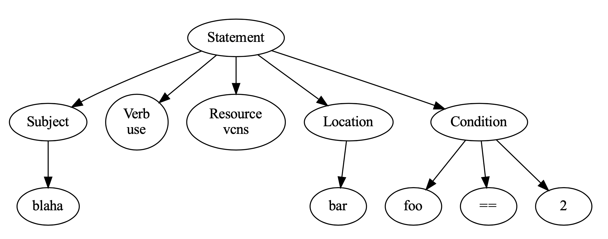

## OCI Policies Parser
Build simplified OCI policies parser with Lex and Yacc.


## Grammar
```
statement -> Allow <subject> to <verb> <resource-type> in <location> where <condition>
subject -> group variable
verb -> manage | use
resource-type -> vcns | subnets
location -> variable
variable -> v
condition -> v = s | v != s

Examples:
Allow group admins to use vcns in tenancy
Allow group blaha to use subnets in bar where foo > "cond"
```



## Install & Run
```
# execute taget for environment setup
make setup

# build, test, run as
make build test run
```

